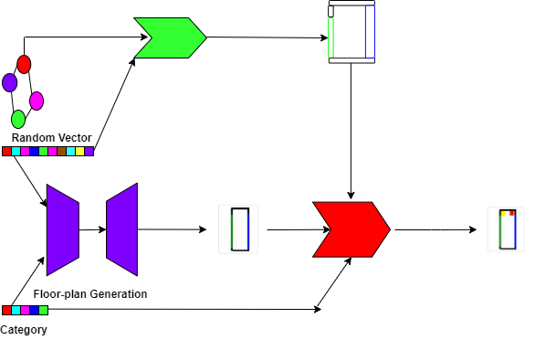

# End-to-end Generative Floor-plan and Layout with Attributes and Relation Graph
# Overview
This repository contains a dataset of indoor furniture layouts together with an end-to-end rendering image of the interior layout. This layout data is from designers at the real selling end.There are 60 professional designers who work with an industry-lever virtual tool to produce a variety of designs. Among these designs, part of them are sold to the proprietors for their interior decorations. We collect these designs at the selling end and provide 710,700 interior layouts. Each sample of the layout has the following representation including the categories of the furniture in one room, the position (x,y) and size (height, width, length) of each furniture, the position (x,y) and size (height, width, length) of the doors, windows, and walls in the room. Besides, the category of the finished furniture and customized furniture is given. For the customized furniture, the size (height, width, length) is the default size in the default layout. In the other layout of the same room, the size of the customized furniture is different. In particular, there are 2k samples of the layout for balcony, 22k samples of the layout for bedroom, 185k samples of the layout for kitchen, 400k samples of the layout for bathroom, 80k samples of the layout for living-dining room, 1.7k samples of the layout for study room, and 20k samples of the layout for tatami room. 

# Sample1
The size of the custom cabinet and the size of the working desk is different for different layout of the same bedroom room. The size of the customized furniture changes according to the requirements of the customers.

# Sample2
The size of the tatami is differentfor different layout of the same tatami room. The size of the customized furniture changes according to the requirements of the customers.

# Sample3
The size of the bathroom cabinet, the bathtub is different for different layout of the same bathroom. The size of the customized furniture changes according to the requirements of the customers.

# Sample4
The size of the dining table, the sofa is different for different layout of the same living-ding-room. The size of the customized furniture changes according to the requirements of the customers.

# Sample5
The size of the working desk, the bookcase is different for different layout of thre same study room. The size of the customized furniture changes according to the requirements of the customers.

# Sample6
Other samples are shown.

# Update Information
Overseas distribution began. (2020/11/16)

# User Qualification
Only researchers belonging to a university or a public research institution can apply to use the Data. Applications from those belonging to a private company, etc. will not be accepted. Usage is limited to academic research purposes only. For more details, please email the IDR office in the Contact section below.

# Application

1.Please read the Layout of Custom-size Furniture Dataset Terms of Use，the Handling of LCSF Dataset and the Terms of LCSF Dataset Service carefully and, confirming that they are acceptable to you (and your organization), fill out the Application Form following the items below: a.An application should be made for each user group such as a laboratory in a university, and the applicant should be a principal investigator in the group, e.g., a professor at a university or a head researcher at a research institution. b.The signer of the Consent Form should be a person authorized to sign the contract on behalf of your organization (typically, a dean of a school or higher for universities). Please consult with your administrative section about the qualified signer beforehand and enter formal information in full for the Signer as to be printed in the Consent Form. c."Research group members" are restricted to the researchers and students belonging to the abovementioned user group and doing research under supervision of the applicant. If someone belonging to a different organization or a separate laboratory, even in joint research, will use the data, a separate application should be made.

2.Please send the application form as an email attachment to the IDR office shown in the Contact section below. a.The subject of the email should be "Application for the LLCSF Dataset (Xxxx University)." If the subject is not appropriate, the email may be discarded without its content being reviewed. b.When applying for other datasets at the same time, please send each application as a separate email.c.Please note that your application will be forwarded to LIFULL Co., Ltd. and will be used to judge qualification, prepare the Consent Form, and manage users.d.If a member of your laboratory is working for a specific company and/or if your laboratory has a close connection with a specific company, e.g. doing a joint research project, you may not be granted approval to use the Dataset depending on its situation and/or its relation to the research you are going to do using the Dataset. The IDR office may approach you for more information if required.

3.Your application will be reviewed at the LCSF dataset office and the availability of the data will be emailed to you. If you do not receive a reply email within a week, please contact the IDR office.

4.Please submit an Consent Form to Us.The LCSF dataset office will send you an Consent Form by email. The Consent Form should be signed by the signer and PI, and be sent by post to the Contact (LCSF dataset Office) shown below.

5.The LCSF dataset office will provide the data when your signed Consent Form has been received.

6.The High Resolution Layout Renderring Image Data will be provided if LCSF Co., Ltd. allows it to be used for your purpose. To apply for use, after being provided with the LCSF Dataset, follow the instructions posted on the data download site.

# Data provision
The data will be provided by downloading from the LCSF Dataset Web server.

# Usage report, etc.
You are required to give LCSF Co., Ltd. notice in advance of any press releases or media interviews regarding research results.Please submit a report on publications at conferences and in journals every year in response to a request from the LCSF DATASET office.Before a private company employee joins the laboratory or your laboratory starts a new collaboration with a private company after signing the Consent Form, please consult with the IDR office well in advance.

# Documents
1.Application Form

2.LCSF Dataset Terms of Use

3.Handling of LCSF Dataset

4.Terms of LCSF Dataset Service

5.Consent Form (sample)

# A proposed model for the layout of the custom-size furniture, code and model will be released soon:)

# Contact Email
deepearthgo@gmail.com
